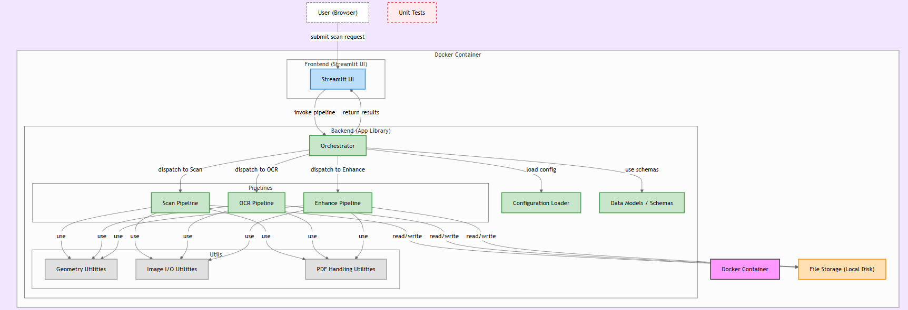

# 🧠 **NeuroScan-AI**
### *An Advanced Document-Intelligence Engine built for AI Engineers by [Muhammad Wasif Anwar](https://github.com/mwasifanwar)*  

---

> ⚡ **“Turning raw pixels into readable intelligence.”**

NeuroScan-AI is a **next-generation document-understanding system** that bridges the gap between **computer vision**, **OCR intelligence**, and **AI-driven image enhancement**.  
Designed with precision and modularity, it empowers engineers, researchers, and enterprises to **transform raw document captures into structured, searchable, and professional-grade digital assets.**

---

### 🧬 **What Makes It Different**
- 🔹 **End-to-End Intelligence:** Automates the full workflow — *Scan → Enhance → OCR → Export.*
- 🔹 **AI-Enhanced Vision:** Utilizes adaptive illumination correction, geometric perspective repair, and unsharp filtering for maximum OCR clarity.
- 🔹 **Seamless Dual Interface:** Offers both an interactive **Streamlit UI** and a robust **FastAPI backend** for integration into enterprise systems.
- 🔹 **Containerized Precision:** Every component runs in an isolated, reproducible **Docker environment**, ensuring identical performance across setups.
- 🔹 **Engineer-First Architecture:** Built with clear module separation, making pipelines reusable and extensible for any vision or OCR-based AI project.

---

### 🏗️ **Core Mission**
> 🧠 *“To redefine how machines perceive documents — not as flat images, but as structured, interpretable intelligence.”*

NeuroScan-AI isn’t just a scanner — it’s a **document perception engine**.  
Every pixel processed through it passes through a scientifically tuned visual pipeline — enhancing edges, reducing noise, balancing illumination, and extracting text with the same fidelity as a human eye trained on detail.

---

### 🧩 **Crafted For**
| 👤 User Type | 💡 Purpose |
|---------------|------------|
| **AI Engineers** | Integrate OCR & enhancement modules in ML pipelines |
| **Developers** | Deploy production-ready document processing APIs |
| **Researchers** | Digitize academic papers or experiment datasets |
| **Organizations** | Automate document archiving with precision scanning |
| **Data Scientists** | Build structured datasets from unstructured inputs |

---

## 🧩 **Overview**

**NeuroScan-AI** is not just another scanner — it’s an **intelligent document-perception system** engineered to make computers truly *understand* paper.  
Every scan, every pixel, every curve of a letter is treated as meaningful data — processed through a chain of AI-powered transformations that make even imperfect captures look professionally digitized.

Built from the ground up using **OpenCV**, **scikit-image**, and **Tesseract OCR**, it merges the precision of computer vision with the adaptability of modern AI engineering.  
Whether you’re scanning invoices, legal documents, research papers, or handwritten notes, NeuroScan-AI intelligently detects the document frame, corrects distortions, balances lighting, and extracts clean, searchable text.

What sets it apart is its **dual-interface ecosystem**:
- 🖥️ A sleek **Streamlit UI** for instant, no-code scanning and previewing.  
- ⚙️ A powerful **FastAPI backend** for developers who want to integrate document intelligence into their own platforms.

All of this is containerized using **Docker**, ensuring you can deploy it anywhere — from your local workstation to a full enterprise cloud — with identical performance and zero dependency hassle.  
The result is a **research-grade yet production-ready** solution that feels effortless to use but is deeply engineered underneath.

---

## ⚙️ **Key Features**

### 🧠 **Intelligent Document Processing**
A three-stage perception pipeline — **Scan → Enhance → OCR** — built for precision and repeatability.  
Each stage is modular, allowing you to use them independently or together within your own projects.

### 🔍 **Perspective Correction & Deskewing**
Automatically identifies document edges and corrects geometry in real-time.  
No matter the angle or lighting of your photo, NeuroScan-AI re-shapes it into a perfectly rectangular, printable scan.

### 🌗 **Adaptive Illumination Balancing**
Uneven lighting, glare, and shadowed edges are intelligently normalized using morphological and contrast-based enhancement — giving you crisp, uniformly lit outputs suitable for OCR and archiving.

### 🖼️ **Contrast & Unsharp Enhancement**
Fine-tuned filtering boosts clarity and edge definition, ensuring even faint or faded text becomes legible without introducing noise or over-sharpening artifacts.

### 📄 **Searchable PDF Generation**
Beyond simple text extraction — NeuroScan-AI embeds recognized text directly into PDFs, making them **fully searchable** while preserving the original layout and structure.

### 🧾 **Multi-Page PDF Support**
Upload full documents — the system automatically splits, enhances, and runs OCR on every page, stitching them back into a seamless, text-searchable PDF file.

### 🧰 **Powerful Utility Layer**
Includes modular utility classes for **geometry processing**, **image I/O**, and **PDF handling**, allowing researchers and developers to extend functionality with ease.

### 🧪 **Tested & Reliable**
Each core component is unit-tested for consistency, ensuring reproducible results whether you run it once or a thousand times in batch mode.

### 🐳 **Dockerized & Portable**
Fully containerized with environment isolation, making setup frictionless and deployment instantaneous — from personal laptops to enterprise servers.

### ⚡ **Dual-Mode Access**
Use it visually through **Streamlit** or programmatically through **FastAPI** endpoints.  
Scan, enhance, and extract text either interactively or as part of your automated pipelines.

---

> ✨ *In essence, NeuroScan-AI turns imperfect, real-world documents into structured, searchable intelligence — bringing clarity where there was once only clutter.*

## 🧱 **System Architecture**

NeuroScan-AI follows a clean, layered architecture that separates **experience**, **orchestration**, **pipelines**, and **utilities** for reliability and easy extension. The diagram below shows how a request flows from the **Streamlit UI** (or API client) through the **Orchestrator** into specialized **Scan / Enhance / OCR** stages, with shared **Utils** and **Config/Schemas** ensuring consistency — all inside a **Docker** runtime.

<p align="center">
  
</p>

### 🧩 Components at a Glance
- 🎛 **Streamlit UI (Frontend)** — Drag-and-drop uploads, side-panel controls (OCR lang/OEM/PSM), live previews (original vs scanned), and one-click downloads (searchable PDF / PNG ZIP).
- 🧠 **Orchestrator (Backend Library)** — Validates inputs, loads config, and **dispatches** each page to the right pipeline stage: *Scan → Enhance → OCR*; aggregates multi-page results.
- 🔬 **Pipelines**
  - 📐 **Scan Pipeline** — Edge detection, 4-point perspective transform, auto-deskew fallback when no quad is found.
  - ✨ **Enhance Pipeline** — Illumination correction (background removal), CLAHE, adaptive binarization, and unsharp mask for OCR clarity.
  - 🔎 **OCR Pipeline** — Tesseract OCR with configurable *lang / OEM / PSM* and **searchable PDF** generation.
- 🧰 **Utility Layer** — Reusable helpers for:
  - 📏 **Geometry** (order points, perspective transform, deskew)
  - 🖼 **Image I/O** (safe decode/encode, RGB↔BGR)
  - 📄 **PDF Handling** (pdf2image conversion, multi-page orchestration)
- ⚙️ **Configuration & Schemas** — Centralized settings (env-driven) and Pydantic models that enforce types/validation across UI and API.
- 🐳 **Docker Container** — Bakes the exact runtime (Tesseract, Poppler, OpenCV libs) for reproducible results on any machine or cloud node.

### 🔁 Request → Result (Data Flow)
1. **Upload**: User drops an image/PDF in Streamlit (or sends to FastAPI).
2. **Split/Decode**: PDFs become per-page RGB images; images are decoded safely.
3. **Scan**: Document borders are detected; perspective corrected; deskew fallback if needed.
4. **Enhance**: Illumination normalized → contrast equalized → adaptive thresholding → unsharp mask.
5. **OCR**: Text recognized (multi-language ready); **searchable PDF** pages produced.
6. **Aggregate**: Text concatenated; pages merged; artifacts packaged (PDF/ZIP).
7. **Deliver**: Results streamed back to UI/API with sizes, previews, and downloads.

### 🧠 Why this layout?
- **Modularity** → swap or upgrade any stage (e.g., CRAFT/EAST for text detection) without touching others.  
- **Reproducibility** → deterministic behavior via config + Docker.  
- **Performance** → lightweight CV ops with smart fallbacks; page-wise parallelization is easy to add.  
- **Integrations** → clear API boundaries make it trivial to plug into CRMs, EHRs, RPA, or MLOps jobs.

---

## 🗂 **Directory Structure**

```markdown
<details>
<summary><b>Click to view directory tree</b></summary>

```text
NeuroScan-AI/
├─ app/
│  ├─ pipelines/
│  │  ├─ scan.py
│  │  ├─ enhance.py
│  │  └─ ocr.py
│  ├─ utils/
│  │  ├─ geometry.py
│  │  ├─ image_io.py
│  │  └─ pdf.py
│  ├─ config.py
│  ├─ schemas.py
│  └─ main.py
├─ web/
│  └─ streamlit_app.py
├─ reports/
│  └─ architecture.png
├─ tests/
│  ├─ test_geometry.py
│  └─ test_scan_pipeline.py
├─ requirements.txt
├─ Dockerfile
├─ .env.example
└─ README.md
</details> ```

## 🧰 **Tech Stack & Installation Guide**

NeuroScan-AI is powered by a **carefully engineered technology stack**—blending state-of-the-art computer vision, OCR, and API frameworks to deliver precision, speed, and modular scalability.  
Every component has been hand-picked to ensure that the system performs flawlessly across environments, whether you’re an AI researcher or a production engineer deploying in the cloud.

---

### 🧩 **Core Technologies**

| ⚙️ **Layer** | 🧠 **Technology** | 🎯 **Purpose & Role** |
|--------------|------------------|------------------------|
| 🎨 **Frontend** | **Streamlit** | A lightweight, elegant interface for real-time document uploads, visualization, and download. Enables an intuitive experience for non-technical users. |
| 🧠 **Backend** | **FastAPI** | The heart of NeuroScan-AI — orchestrates scanning, enhancement, and OCR pipelines while exposing clean REST endpoints. |
| 🔍 **OCR Engine** | **Tesseract OCR** | Responsible for the actual text extraction and searchable PDF generation, supporting multilingual configurations and layout-aware recognition. |
| 👁 **Vision Core** | **OpenCV**, **NumPy**, **scikit-image** | Handles image processing: perspective correction, contrast balancing, illumination normalization, and deskewing. |
| 📄 **File Management** | **pdf2image**, **Pillow** | Manages high-resolution PDF page conversion, encoding, and seamless I/O operations. |
| 🧱 **Containerization** | **Docker** | Provides reproducible runtime with all dependencies — ensuring identical OCR and image-processing results on any system. |
| 🧪 **Testing Framework** | **pytest** | Guarantees reliability and reproducibility across modules with automated unit and pipeline tests. |

> 💡 *Every tool was chosen not for trend — but for its precision, maturity, and compatibility in building intelligent vision pipelines.*

---

## ⚡ **Installation & Setup**

Setting up **NeuroScan-AI** takes only a few minutes — whether you’re running it locally for research or deploying it as a containerized microservice.

---

### 🧩 **Step 1: Clone the Repository**

git clone https://github.com/mwasifanwar/NeuroScan-AI.git
cd NeuroScan-AI

## ⚙️ **Step 2: Install Dependencies**

Before running NeuroScan-AI, install all the required Python dependencies.  
These include powerful libraries such as **OpenCV**, **Tesseract bindings**, and **FastAPI** that together drive the document processing pipeline.

pip install -r requirements.txt

💡 This command installs everything — from image enhancement and OCR components to backend orchestration frameworks, ensuring that every module is ready to perform seamlessly.

## 🔧 **Step 3: Configure the Environment**

Before running NeuroScan-AI, you’ll need to configure the environment so that the OCR and enhancement pipelines function correctly across all systems.  
This setup ensures that **Tesseract OCR** knows where to locate its executable file, and that the pipeline uses the correct **OCR settings**.

---

### 🧩 **1️⃣ Copy the Sample Environment File**

Start by copying the example configuration file into your working directory:

cp .env.example .env

⚙️ 2️⃣ Edit the .env File

Open the .env file and configure the following settings according to your system:

TESSERACT_CMD=C:\Program Files\Tesseract-OCR\tesseract.exe
OCR_LANG=eng
OCR_OEM=3
OCR_PSM=6


Explanation of Parameters:

🧭 TESSERACT_CMD → The path to your local Tesseract executable.

Required for Windows users (for Linux/macOS, it’s usually auto-detected).

🌐 OCR_LANG → Language(s) for text extraction. Default: English (eng).

🧮 OCR_OEM → OCR Engine Mode:
0 → Legacy Engine
1 → Neural Nets LSTM Engine
2 → Combined Legacy + LSTM
3 → Default Auto-Select (Recommended)
📄 OCR_PSM → Page Segmentation Mode (layout assumption).
Common values: 3 (auto layout), 6 (single uniform block), 11 (sparse text).

🧠 Tip

You can enable multilingual OCR easily by combining languages:
OCR_LANG=eng+deu+fra

➡️ This example enables English, German, and French recognition simultaneously —
perfect for international document scanning and multilingual archives.

## 🚀 **Step 4: Run NeuroScan-AI**

NeuroScan-AI can operate in two powerful modes —  
a **Visual Mode** for intuitive, real-time interaction and a **Headless Mode** for integration into large-scale automation pipelines or backend systems.  
Choose the mode that best fits your workflow.

---

### 🖥️ **Streamlit Frontend (Visual Mode)**

Launch the **Streamlit web interface** for real-time document scanning, enhancement, and OCR execution.

streamlit run web/streamlit_app.py
Once started, the app opens automatically in your browser, providing an interactive experience that requires no coding.

✨ Features at a Glance
🧩 Feature	💡 Description
📁 Drag & Drop Uploads	Upload images or PDFs directly from your desktop into the interface.
🧩 Instant Preview	Compare Original vs Enhanced versions side-by-side with smooth, live rendering.
🧠 Dynamic OCR Toggle	Enable or disable text extraction instantly without restarting the process.
📥 One-Click Downloads	Export processed outputs as searchable PDFs or enhanced PNG ZIPs.

💡 Perfect for students, researchers, developers, and data engineers who want a hands-on, visual experience without writing a single line of code.

## 🔗 **API Endpoints**

NeuroScan-AI provides a clean, well-documented REST API built with **FastAPI**, enabling developers to seamlessly integrate document scanning, enhancement, and OCR features into their own systems, workflows, or applications.

Each endpoint is lightweight, asynchronous, and fully compatible with JSON responses, allowing smooth integration with any frontend, automation tool, or enterprise backend.

---

| 🌐 **Endpoint** | 🔧 **Method** | 📘 **Description** |
|-----------------|---------------|--------------------|
| `/health` | `GET` | Performs a quick API health check — verifies that the service is running and reachable. |
| `/scan` | `POST` | Accepts an **image or PDF upload**, performs the complete pipeline *(Scan → Enhance → OCR)*, and returns structured text output along with metadata such as image dimensions and processing time. |
| `/scan/pdf` | `POST` | Converts uploaded documents into **fully searchable PDFs**, embedding OCR text layers directly into the file while preserving the original visual layout. |

---

### ⚙️ **Example Usage (via cURL)**

curl -X POST "http://localhost:8000/scan" \
  -F "file=@document.jpg" \
  -F "ocr=true" \
  -F "lang=eng"

✅ Response: Returns a JSON object containing:
Extracted text (OCR output)
Metadata (dimensions, page count, execution time)

Optional base64 or file download links (depending on configuration)

<br>

<h2 align="center">✨ Author</h2>

<p align="center">
  <b>Muhammad Wasif</b><br>
 AI/ML Developer @ Effixly AI
</p>

<p align="center">
  <a href="https://www.linkedin.com/in/mwasifanwar" target="_blank">
    
  </a>
  <a href="mailto:wasifsdk@gmail.com">
    
  </a>
  <a href="https://mwasif.dev" target="_blank">
    
  </a>
</p>

<p align="center">
  <em>⭐ *If perception is the first step toward intelligence, NeuroScan-AI is where machines begin to truly see.*</em>  
</p>

<br>
